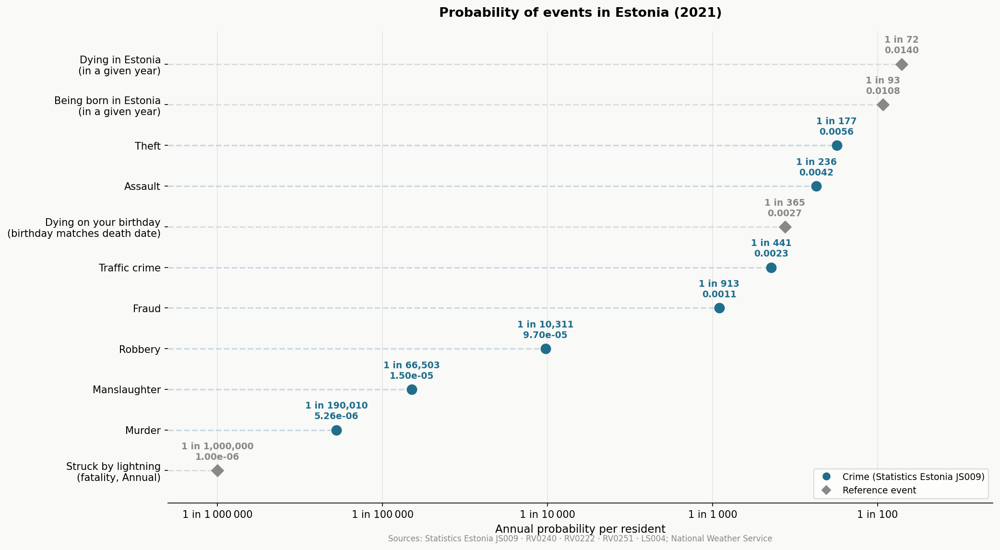
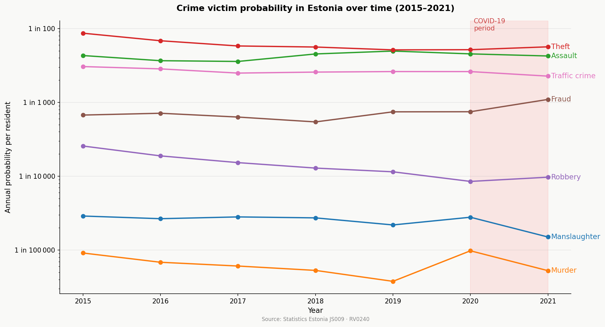

# Estonian Crime Probability Scale

Inspired by the idea of building intuition for probability through real-world comparisons.
A probability scale visualising the likelihood of various events in Estonia,
combining official Statistics Estonia data with reference events to build
intuition about probability.

## What it does

Fetches registered crime counts by type from the Statistics Estonia API (table JS009),
divides by the Estonian population, and plots each crime type as an annual per-person
probability on a logarithmic scale.

To give readers a sense of scale, each chart also includes **reference/anchor events** -
everyday probabilities (being born, dying, a lightning fatality) drawn from other 
Statistics Estonia tables and publicly available sources
(e.g. National Weather Service for lightning risk). These are shown as grey diamonds
so they are visually distinct from the crime data. Each label shows both the "1 in X"
form and the raw decimal probability, so readers can build intuition in both formats.
This turns the chart into a **probability scale**, where unfamiliar risks
(e.g. crime) can be compared against more intuitive reference points.

Two types of visualisation are produced:

- **Per-year lollipop charts** - all event probabilities for a given year on one scale
- **Trend line chart** - how crime probabilities shifted from 2015 to 2021 (anchor events excluded)

## Results

### Probability scale (2021)
Equivalent probability scale charts are generated for each year from 2015 to 2021.


The anchor events show that theft (~1 in 177, 0.0056) sits just below the chance of
being born in Estonia that year (1 in 96). Murder (1 in 190 000, 5.26e-06) is in the
same ballpark as a lightning fatality (~1 in 1,000,000 per year) - a useful frame of reference for just how rare
these events are.

### Trend over time (2015–2021)


The most common crime by far is theft (~1 in 177 in 2021), followed by assault (~1 in 236).
Murder remains extremely rare (~1 in 190 000). Over the 2015–2021 period, robbery declined
steadily while fraud rose sharply - likely reflecting a broader shift toward online crime.

The COVID-19 period (2020–2021) shows several notable patterns: robbery dropped in 2020,
consistent with reduced street activity during lockdowns. Fraud rose sharply in 2021,
likely reflecting increased online activity. Most strikingly, murder cases nearly doubled
in 2020 before returning to baseline - rising from 5 cases in 2019 to 13 in 2020, then
back to 7 in 2021. This is possibly linked to increased domestic violence during lockdowns,
though the absolute numbers are so small that a single-digit change produces a dramatic
shift on a log scale. This is a known limitation when working with rare events - interpret
with caution.

## Data sources

**Crime data**
- [Statistics Estonia JS009](https://andmed.stat.ee/et/stat/JS009) - Registered crimes by type and county, 2015–2021

**Population**
- [Statistics Estonia RV0240](https://andmed.stat.ee/et/stat/RV0240) - Estonian population by year

**Reference/anchor events**
- [Statistics Estonia RV030](https://andmed.stat.ee/et/stat/RV030) - Live births and deaths per year (Näitaja '1' and '2')
- National Weather Service - Lightning safety and odds - https://www.weather.gov/safety/lightning-odds
- Birthday coincidence: deterministic (1/365)

## Limitations

- Based on reported crimes only. Unreported cases are not captured
  (true probabilities are likely higher due to the dark figure of crime).
- Assumes each reported case involves a unique victim.
- Population used as denominator is total Estonian population, not at-risk subgroups.
- With rare crime types (e.g. murder, ~7 cases/year), small absolute changes
  produce large swings in probability - interpret with caution.
- The lightning strike probability is based on widely cited estimates from the National Weather Service; Estonia-specific 
data was not available.

## How to run

Install dependencies:
```bash
pip install requests matplotlib
```

Run in order:
```bash
python fetch_data.py   # fetches crime, population, births and deaths from Statistics Estonia API
python process.py      # computes per-person probabilities and adds anchor events for each year
python plot.py         # generates per-year lollipop charts → output/probability_scale_YYYY.png
python plot_trend.py   # generates trend line chart → output/probability_trend.png
```

## License

MIT