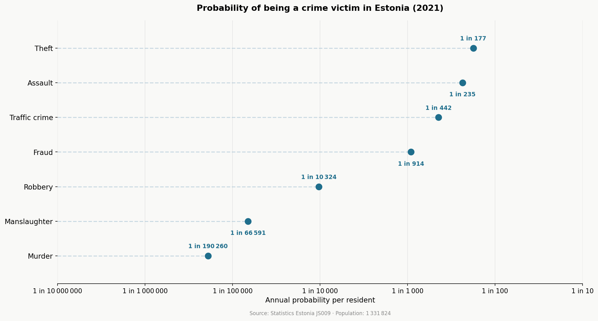

# Estonian Crime Probability Scale

A probability scale visualising the likelihood of being a crime victim in Estonia,
built from official Statistics Estonia data.

## What it does

Fetches registered crime counts by type from the Statistics Estonia API (table JS009),
divides by the Estonian population, and plots each crime type as an annual per-person
probability on a logarithmic scale.

## Results



## Data source

- **Crime data**: [Statistics Estonia JS009](https://andmed.stat.ee/et/stat/JS009)
  — Registered crimes by type and county, 2006–2021
- **Population**: Statistics Estonia RV0240 — 1 331 824 (2021)

## Limitations

- Based on reported crimes only. Unreported cases are not captured
  (true probabilities are likely higher due to the dark figure of crime).
- Assumes each reported case involves a unique victim.

## How to run

Install dependencies:
```bash
pip install requests matplotlib
```

Run in order:
```bash
python fetch_data.py   # fetches raw data from Statistics Estonia API
python process.py      # computes probabilities
python plot.py         # generates the chart → output/probability_scale.png
```

## License

MIT